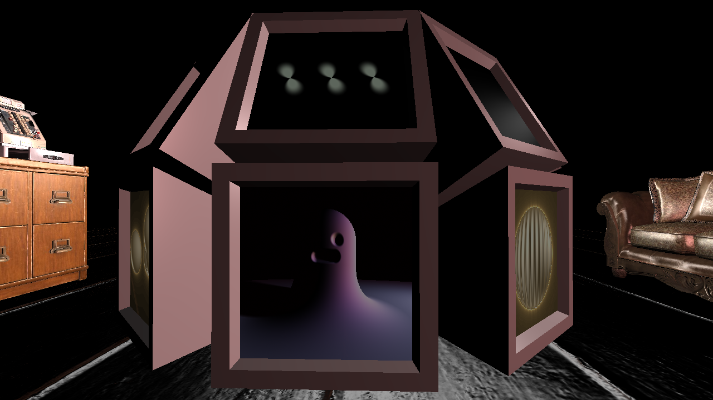

# TDT4230 Final Project

An exploration of ray marching displayed on monitors in a dimly lit room.

Some of the shaders in this project are published on Shadertoy:

+ [Statue in shadow](https://www.shadertoy.com/view/ft2yW1)
+ [Gyroid minus sphere](https://www.shadertoy.com/view/7tscW4)
+ [Procedural landscape](https://www.shadertoy.com/view/fl2yWm) (see credits section)

# Usage

Install [Rust](https://www.rust-lang.org/tools/install) and run the program with `cargo run`.

# Controls

## Standard camera

+ **1-8** and **F1-F8** to focus on a monitor
+ **Space** to reverse rotation direction

## Freely movable camera

+ **WASD** to move horizontally and **QE** to move vertically
+ Mouse to look around

## Other keybinds

+ **F** to switch between camera modes
+ **R** to show reflections without Fresnel effect or shaders obscuring them
+ **C** to switch between cubemap-based and planar reflections
+ **N** to show normals
+ **M** to show reflection vectors

# Credits

+ Terrain generation and lighting equations in shaders [landscape.frag](res/shaders/landscape.frag) and [whateverwave.frag](res/shaders/whateverwave.frag): [This video](https://youtu.be/BFld4EBO2RE) by Inigo Iquelez
+ Some SDFs and smooth operators: [Also by this Inigo Quilez dude](https://iquilezles.org/articles/distfunctions/)
+ Goose model: [Atlas on Sketchfab](https://sketchfab.com/3d-models/goose-low-poly-3318893e41fc4d2f9f497776da95c13a)
+ Other high-fidelity models and textures were taken from [PolyHaven](https://polyhaven.com).
