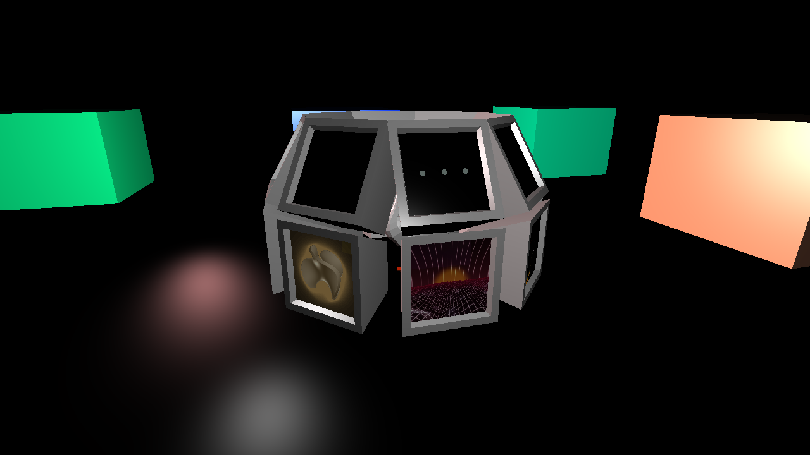
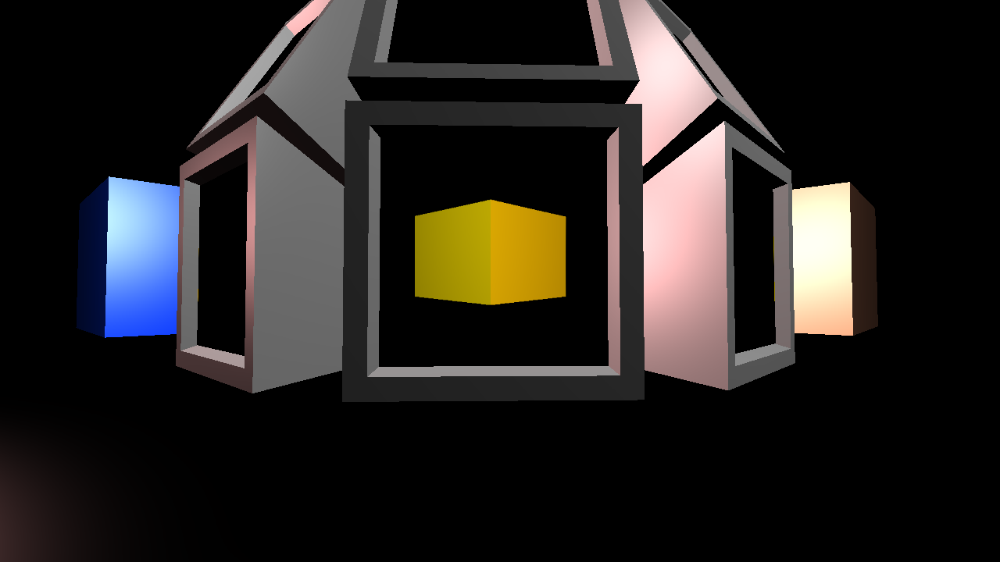
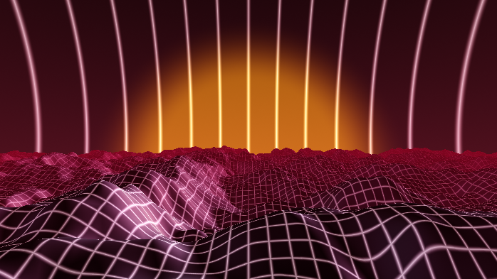
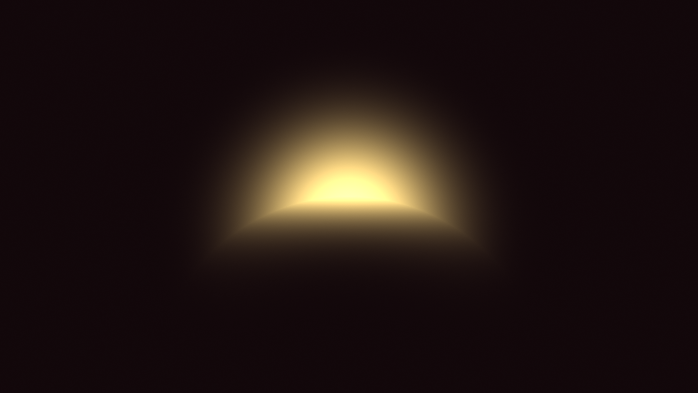

# Concept

The project's goal was a scene with a heap of CRT monitors showing various visuals rendered in real-time, as well as reflecting the surrounding scene in a somewhat realistic manner.

A personal note: I stumbled down the rabbit hole of this rendering technique a month or so before the project started via some intriguing videos [@cp_raymarching; @aoc_raymarching], and decided I would delve into this in the project in some way. This is why the project ended up being an exploration of ray marching in addition to a more conventionally rendered scene.

# Implementation

<!-- make this more focused on the points in the project description -->

<!-- This section will go over the various techniques used to render the complete scene and highlight problems. -->

The project was written in Rust with the `glow-rs` wrapper for OpenGL. The scene graph was implemented with node references as indexes into a list of nodes, inspired by an article that described a simple way to do tree structures in Rust without dealing with the language's pecularities [@index_tree]. Lighting and material properties was handled similarly to the last assignment.

## Animated Camera

The camera was intended to revolve around the center of the scene, showing the content of the screens and reflections on the screens at the edges. This was achieved using a look-at matrix with vectors defined like so:
$$
\begin{aligned}
  v_{\text{ground}} &= [\cos r, 0, \sin r],\quad
  v_{\text{eye}} = [\cos r, h, \sin r]\\
  v_{\text{center}} &= \text{lowermost point of the crt structure}\\
  v_{\text{up}} &= (v_{\text{center}} - v_{\text{eye}}) \times ((v_{\text{center}} - v_{\text{eye}}) \times (v_{\text{ground}} - v_{\text{eye}}))
,\end{aligned}
$$
where $r$ is the radius and $h$ is the height of the orbit.

For inspecting visuals on the screens more closely, button presses were tied to animations that zoomed in and made the camera stay in front of a chosen screen. The transition was achieved using linear and spherical interpolation (GLM's `mix` and `slerp` functions) of position and orientation vectors respectively, inspired by a StackOverflow answer [@stackoverflow_interpolation].
The animations flowed smoothly, but it was possible to clip through the heap of CRTs during the transition.

## Reflections

For real-time reflections, two different approaches were tested. Both involved rendering the scene from the perspective of the reflective objects. Regardless of the approach used for rendering the reflected environment, the reflection was added to the color of the reflective surface weighted by an approximation of the Fresnel effect [@nvidia_fresnel], as shown in +@fig:fresnel.
$$
\max(0, \min(1, \text{bias} + \text{scale} \cdot (1 + I \cdot N)^{\text{power}}))
$$

<!-- ### Planar Approach -->

The first approach was to render the scene from the perspective of the reflective object to _one_ two-dimensional texture. When rendering, the texture coordinates of the objects were combined with the reflection vector to approximate the look of a refleciton, using the following homemade mapping:
$$
\begin{aligned}
  r_{uv} = ( 0.25\cdot (t_{uv} - 0.5) + 0.75\cdot 0.5\cdot  (TBN^{-1} \cdot  r_{x,y} ) )\cdot 0.5 + 0.5
,\end{aligned}
$$
where $t_{uv}$ is the texture coordinates, $TBN$ is a matrix that transforms from tangent to world space, $r$ is the reflection vector and $r_{uv}$ is the reflection texture coordinates. This mapping resulted in an odd bending of the reflections, and did not look particularily realistic, see +@fig:planar.

<!-- ### Cubemaps -->

The second approach was to use cubemaps --- collections of six textures representing the faces of a cube. In the case of reflections, the textures are based on what can be seen of the surrounding area from a reflective object. This was implemented using look-at matrices with up and center vectors tailored to each of the six faces. See +@fig:cubemap.

Implementing both approches was more troublesome than expected. Creating the transformation matrices for the perspectives of the reflective objects turned out to be a minefield of near-solutions that flipped some part of the scene around and sometimes required reversing the winding order to have the result make any sense at all. The transformation for the planar reflections was reworked to use the total rotation along each axis instead of extracting rotation from the model matrices. This turned out to be easier to deal with.
In the final stretch of the project, the reflections were tested in a more complex environment (compare to +@fig:test_scene and @fig:test_scene_closeup) and several issues were discovered and fixed --- the most egregious was the lack of depth testing because depth buffers had not been bound in the creation of the off-screen framebuffers, see +@fig:depth_issues. Another issue was that the reflections were rendered upside down, which was not clear from the test scene.
In the final result, the reflections based on cubemaps did not handle rotations between the four cardinal directions well. Additionally, since the reflections needed a moderately large canvas for details to carry over properly, and adding interesting animations to the surrounding environment was not prioritized, they were rendered once at the start instead of for each frame.

## Visualizations

The contents of the screens were rendered one by one in a first pass to a texture, before being merged with the 'ordinary' scene in a post-processing step. This initial rendering involved drawing each screen plane with the specific fragment shader that rendered its contents, to the same framebuffer successively. This allowed the visuals to be displayed at arbitrary resolutions depending on how the camera was positioned, see +@fig:screens_closer and @fig:screens_zoomed. Rendering only the pixels that are needed would be beneficial for reflections as well, but testing yet another approach to reflections was not prioritized.

### Ray Marching

Most of the screens were made to show some ray-marched scene.
Ray marching is performed by stepping along a ray with step distance equal to an estimate of how far away anything in the scene is, until the distance drops below some threshold and the ray must have hit something.
This technique can be modified to achieve various effects.

<!-- ### Signed Distance Functions -->

To find the closest distance to anything in the scene, ray marching uses signed distance functions, hereafter called SDFs. SDFs give exact or estimated distances to a surface, as well as the distance to a surface from _inside_ the surface, with the latter represented as negative values. As an example, consider the SDF
$d = |p - c| - r,$
where $d$ is the distance from $p$ to the sphere with center $c$ and radius $r$. Here, any point inside the sphere will have $d < 0$ since $|p - c| < r$, and any point outside the sphere's surface will have $d > 0$ since $|p - c| > r$.

<!-- simple illustration and explanation of sphere sdf -->

SDFs can be combined using simple operations like `min` and `max` (corresponding to boolean union and intersection, respectively) to create more complex shapes [@jamie_sdf], see +@fig:sculpting for a smoothened example. Additionally, one can increase the complexity of a surface by adding some other function to its SDF, as shown in +@fig:ripples, or by applying other transformations like scaling or twisting, typically by transforming the input to the SDF.
Some of the shaders in this project use Inigo Iquelez' smooth combination operators [@iq_smooth], and some SDFs were taken from the same person's library [@iq_sdfs].

<!-- something about that landscape video -->

On the less accurate side of SDFs, it is possible to use functions from 2D coordinates to scalars as 3D SDFs by letting the distance from a point to the $y$ value given by the function be the distance estimate to the whole landscape. Two of the shaders use this approach, with terrain generation from a tutorial on generating landscapes in this way [@iq_landscape], see +@fig:landscapewave. This sort of SDF has blatant inaccuracies that can be alleviated by stepping _less than_ the estimated distance to the scene along the ray while marching, which might lead to reduced performance.

### Effects

<!-- ### Bloom -->

Glow was added to some of the shaders by finding the number of steps taken to reach the back of the scene and mixing in a color based on a multiple of this step count [@hvidtfeldts_lighting; @cp_raymarching]. This created a ringing effect outside the intense glow that I personally liked the look of. However, adding this effect to a scene with a periodic and somewhat inaccurate SDF showed a weakness of this technique, where the glow would be strong in parts of the scene that are empty, see +@fig:screens_zoomed.

<!-- pic of gyroid shader maybe -->

<!-- Similarly to glow, it is possible to use the number of steps travelled along a ray to approximate the complexity of the scene at the point it hits. -->
<!-- (did not really do ambient occlusion) -->

Since ray marching casts rays through a scene, shadows can be rendered by casting a ray to each light source from the point hit by the intial ray, and checking if these rays hit anything on the way. Shadows can be softened, as shown in +@fig:shadows, by using the minimal distance found on the way to determine how dark the occluded point should be.
The shaders with shadows in this project use a soft shadow approch proposed by Inigo Quilez [@iq_shadows].
Some of the shaders displays the light source as a glowing orb by sampling the distance to the light source at fixed point along a ray, see +@fig:light_casting_shadow and +@fig:sunset.

# Conclusion

Doing reflections in the ways I attempted in this project does not seem _ideal_ for live reflections. Rendering textures of decent resolution with full detail for even a few reflective objects might be more taxing as rendering the scene itself. I chose to do it this way because it seemed like a simple way to add reflections, but alas, I was wrong.

Compared to the reflections, displaying the output of different fragment shaders on meshes in a scene was rather easy. The project ended up having a wide variety of shaders demonstrating different effects accomplished with ray marching.

# References

::: {#refs}
:::

# Appendix

{#fig:fresnel}

{#fig:planar}

{#fig:cubemap}

{#fig:test_scene}

{#fig:test_scene_closeup}

{#fig:depth_issues}

{#fig:screens_closer}

{#fig:screens_zoomed}

{#fig:sculpting}

{#fig:ripples}

{#fig:landscapewave}

\clearpage

{#fig:shadows}

{#fig:light_casting_shadow}

{#fig:sunset}
